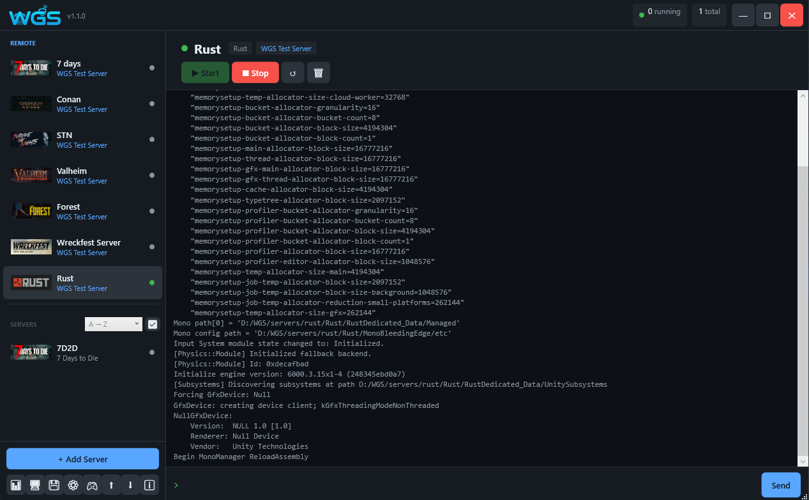

<div align="center">
  
  <h1>Windows Game Server</h1>
  <p><strong>Single-window management panel for Windows game servers</strong></p>

  
  
  
  
  
  

</div>

---

## What is Windows Game Server?

**Windows Game Server (WGS)** is a free, open-source desktop application that lets you host and manage dedicated game servers on any Windows PC — without touching the command line.

Instead of juggling SteamCMD scripts, batch files, Task Scheduler entries and manual firewall rules, WGS brings everything into one clean window:

- **Install** any supported game server in one click — SteamCMD is downloaded and run automatically in the background
- **Start, stop and restart** servers with a single button — or let WGS do it automatically after a crash, with smart crash-loop detection
- **Monitor** CPU and RAM usage per server in real time, with history graphs and a global system dashboard
- **Schedule** automatic restarts, updates and backups at any time of day or week
- **Back up** world saves and configs automatically before every update, with configurable retention
- **Send console commands** directly from the UI — no need to switch windows or open a terminal
- **Edit config files** for any server directly inside WGS, without opening a file manager
- **Install Workshop mods** and manage Oxide/Minecraft plugins from the same interface
- **Add any game** that isn't built-in using the graphical Plugin Creator — no coding required
- **Control servers remotely** via Discord bot commands or the built-in REST API
- **Manage servers on multiple machines** — slave mode lets any PC run as a background agent, controlled from your main WGS window
- **Predict crashes before they happen** — WGS monitors RAM growth and CPU load and warns you in advance
- **Manage firewall rules** automatically — WGS opens and closes the right ports when servers start and stop

WGS is designed for home lab hosts, small community server admins and anyone who wants a clean, reliable way to keep game servers running on Windows without spending time on maintenance.

---

## 📷 Screenshots

<p align="center">
  
</p>

---

> [!IMPORTANT]
> **Windows SmartScreen Warning:**
>
> Since WGS is an independent open-source tool that manages system-level tasks (Firewall, Process Priorities), Windows might show a "SmartScreen" warning.
> To run WGS: Right-click `WindowsGameServer.exe` → **Properties** → Check **Unblock** at the bottom → **OK**.

---

## ✨ Features

### Server management
| Feature | Description |
|---|---|
| 🎮 **50+ supported games** | Ready-made plugins for the most popular game servers |
| ⬇️ **SteamCMD integration** | Install and update servers with one click — SteamCMD downloaded automatically |
| 🔄 **Auto restart** | Automatic restart after crash, with configurable delay |
| 🛡️ **Crash loop detection** | Counts crashes in a 10-minute window — stops retrying after a configurable limit |
| 🔁 **Auto-update** | Periodic SteamCMD updates on a configurable interval while the server runs |

### Monitoring
| Feature | Description |
|---|---|
| 📊 **System dashboard** | Global CPU, RAM and disk usage across all running servers |
| 📈 **Per-server performance charts** | CPU and RAM history graphs (last 6 minutes) per server |
| 👥 **Player management** | Session tracking, total playtime per player and player list — stored in SQLite |
| 🔮 **Crash prediction** | Detects rapid RAM growth, sustained CPU load and memory leaks — warns before a crash happens |
| 🌐 **Bandwidth monitoring** | Real-time per-server and global network I/O (bytes in/out per second, active connections) |

### Automation
| Feature | Description |
|---|---|
| 🗓️ **Task scheduler** | Schedule start, stop, restart, update or backup — once, daily or weekly |
| 💾 **Automatic backups** | Zip backups of world saves before updates, configurable retention policy |

### Remote access
| Feature | Description |
|---|---|
| 📟 **RCON console** | Send commands to running servers via Source RCON protocol |
| 🤖 **Discord bot** | Control servers from any Discord channel: `!start`, `!stop`, `!restart`, `!update`, `!backup`, `!cmd` |
| 🌐 **REST API + Web dashboard** | Built-in HTTP server with a browser-accessible dashboard — start/stop/status/metrics/log viewer |
| 🖥️ **Multi-machine management** | Run WGS as a slave agent on any PC or VPS — master sees and controls all machines in one window |

### Configuration & mods
| Feature | Description |
|---|---|
| 📝 **Config editor** | Browse and edit any server config file directly inside WGS |
| 📁 **File browser** | Full in-app file manager — browse, rename, delete and download server files without leaving WGS |
| 🔩 **Mod manager** | Install and update Oxide/uMod for Rust; manage plugins for Minecraft |
| 🗂️ **Steam Workshop** | Install Workshop items for supported games via SteamCMD |
| 📋 **Server templates** | Save any server configuration as a reusable template — deploy identical servers in seconds |

### System & extensibility
| Feature | Description |
|---|---|
| 🛡️ **Firewall management** | Windows Firewall rules opened/closed automatically on start and stop |
| ⚙️ **CPU affinity & priority** | Per-server core pinning and Windows process priority |
| 🔧 **Custom Plugin Creator** | Graphical tool to add any game server — no code required |
| 📦 **Plugin import / export** | Share plugins as `.cs` files between machines |
| 🔔 **System tray** | Runs minimised in the background with tray notifications |
| 🔒 **Encrypted credentials** | Steam login and Discord bot token encrypted with Windows DPAPI |
| 👤 **User management** | Admin and Viewer roles with per-user API tokens, enable/disable accounts and full audit log |
| ⬇️ **Console auto-scroll** | Console scrolls to latest output automatically; disables when you scroll up manually |
| 🚀 **Start with Windows** | Optional registry entry to launch WGS automatically on login |

---

## 🎮 Supported Games

> `🔑` = Requires owning the game on Steam — authenticate via Steam Guard (email or mobile app). SteamCMD may ask for a new code on every run. &nbsp;|&nbsp; all others install anonymously

### Survival
| Game | Steam AppID | Max Players | Port | |
|---|---|---|---|---|
| 7 Days to Die | 294420 | 8 | 26900 | |
| ARK: Survival Evolved | 376030 | 70 | 7777 | |
| ASKA | 3246670 | 4 | 27015 | |
| ASTRONEER | 728470 | 4 | 7777 | |
| Barotrauma | 1026340 | 16 | 27015 | |
| Conan Exiles | 443030 | 40 | 7777 | |
| Core Keeper | 1963720 | 8 | 27015 | |
| DayZ | 223350 | 60 | 2302 | 🔑 |
| Enshrouded | 2278520 | 16 | 15636 | |
| Don't Starve Together | 343050 | 10 | 10999 | |
| Empyrion - Galactic Survival | 530870 | 8 | 30000 | |
| Longvinter | 1639880 | 32 | 7777 | |
| Necesse | 1169370 | 32 | 14159 | |
| Icarus | 2089300 | 8 | 17777 | |
| No One Survived | 2329680 | 50 | 7777 | |
| Palworld | 2394010 | 32 | 8211 | |
| Project Zomboid | 380870 | 32 | 16261 | |
| Return to Moria | 3349480 | 8 | 20151 | |
| Rising World | 339010 | 16 | 4255 | |
| Rust | 258550 | 100 | 28015 | |
| SCUM | 3792580 | 32 | 10000 | |
| Sons of the Forest | 2465200 | 8 | 8766 | |
| Soulmask | 3017310 | 20 | 8777 | |
| Sunkenland | 2667530 | 8 | 27015 | |
| Survive the Nights | 1502300 | 16 | 7777 | |
| The Forest | 556450 | 64 | 27017 | 🔑 |
| The Isle | 412680 | 75 | 7777 | |
| Unturned | 1110390 | 24 | 27015 | |
| V Rising | 1829350 | 40 | 9876 | |
| Valheim | 896660 | 10 | 2456 | |
| Vein | 2131400 | 16 | 7777 | |
| Wind Rose | 4129620 | 16 | 7777 | |

### FPS
| Game | Steam AppID | Max Players | Port | |
|---|---|---|---|---|
| Black Mesa | 346680 | 24 | 27015 | |
| Counter-Strike 2 | 730 | 10 | 27015 | |
| Garry's Mod | 4020 | 24 | 27015 | |
| Insurgency: Sandstorm | 581330 | 28 | 27102 | |
| Killing Floor 2 | 232130 | 6 | 7777 | 🔑 |
| MORDHAU | 629800 | 64 | 7777 | |
| Team Fortress 2 | 232250 | 24 | 27015 | 🔑 |

### Racing
| Game | Steam AppID | Max Players | Port | |
|---|---|---|---|---|
| Assetto Corsa | 302550 | 18 | 9600 | 🔑 |
| Assetto Corsa Competizione | 1430110 | 24 | 9600 | 🔑 |
| Wreckfest | 361580 | 24 | 33540 | 🔑 |
| Wreckfest 2 | 3519390 | 16 | 30100 | 🔑 |

### Military
| Game | Steam AppID | Max Players | Port | |
|---|---|---|---|---|
| Arma 2: Operation Arrowhead | 33905 | 64 | 2302 | 🔑 |
| Arma 3 | 233780 | 64 | 2302 | 🔑 |
| Arma Reforger | 1874900 | 16 | 2302 | |
| Squad | 403240 | 100 | 7787 | |

### Simulation
| Game | Steam AppID | Max Players | Port | |
|---|---|---|---|---|
| American Truck Simulator | 2239530 | 8 | 27015 | |
| Euro Truck Simulator 2 | 1948160 | 8 | 27015 | 🔑 |
| Satisfactory | 1690800 | 4 | 7777 | |
| Space Engineers | 298740 | 16 | 27016 | |

### Other
| Game | Steam AppID | Max Players | Port | |
|---|---|---|---|---|
| Minecraft Java | — | 20 | 25565 | |
| RedM | — | 32 | 30120 | |
| Terraria | — | 8 | 7777 | |

> `—` = not on Steam; install manually (see plugin description for download link)
>
> The **Custom Plugin Creator** lets you add any other game server without touching code.

---

## 🖥️ Requirements

- **Windows 10 / Windows Server 2019** or newer
- **.NET 8 Runtime** — [download here](https://dotnet.microsoft.com/download/dotnet/8.0)
- **SteamCMD** — downloaded automatically on first install
- Administrator rights for firewall rule management

---

## 🚀 Installation

### Pre-built binary (recommended)

1. Download the latest release from the [Releases](../../releases) page
2. Extract the zip to a folder of your choice
3. Run `WindowsGameServer.exe`
4. If you get a .NET error, install the [.NET 8 Runtime](https://dotnet.microsoft.com/download/dotnet/8.0)

### Build from source

```bash
git clone https://github.com/YOUR_USERNAME/WindowsGameServer.git
cd WindowsGameServer/WGS
dotnet publish -c Release -o publish
```

> Requires [.NET 8 SDK](https://dotnet.microsoft.com/download/dotnet/8.0)

---

## 📦 Project structure

```
WGS/
├── Games/              # Game plugins (IGamePlugin interface)
│   ├── GamePluginBase.cs
│   ├── GameRegistry.cs
│   ├── ValheimPlugin.cs
│   ├── RustPlugin.cs
│   └── ...             # One .cs per game
├── Models/             # Data models (GameServer, ConsoleMessage...)
├── Services/           # Business logic and background services
├── ViewModels/         # MVVM ViewModels
├── Views/              # WPF XAML views
└── publish/            # Published executable output
```

---

## 🔌 Adding a custom plugin

### Graphical Plugin Creator

WGS includes a built-in Plugin Creator tool:
1. Open **Tools → Plugin Creator**
2. Fill in the game details (name, Steam AppID, executable, ports...)
3. Click **Save** — the plugin appears in the game list immediately

You can also export any plugin to a `.cs` file and share it, or import one from another machine via **Tools → Import Plugin**.

### Writing a plugin in code

Create a new file `Games/MyGamePlugin.cs`:

```csharp
using WGS.Games;
using WGS.Models;

public class MyGamePlugin : GamePluginBase
{
    public override string GameId            => "mygame";
    public override string GameName          => "My Game";
    public override string Description       => "Short description";
    public override string Category          => "Survival";
    public override int    SteamAppId        => 123456;
    public override string Executable        => "server.exe";
    public override int    DefaultPort       => 7777;
    public override int    DefaultQueryPort  => 27015;
    public override int    DefaultMaxPlayers => 32;

    public override string BuildStartArguments(GameServer s)
        => $"-port {s.ServerPort} -queryport {s.QueryPort} -maxplayers {s.MaxPlayers}";
}
```

Register it in `Games/GameRegistry.cs`:

```csharp
Register(new MyGamePlugin());
```

---

## 🏗️ Architecture

```
┌─────────────────────────────────────┐
│            WPF UI (XAML)            │
├──────────────┬──────────────────────┤
│  MainViewModel │  ServerViewModel   │  ← CommunityToolkit.Mvvm
├──────────────┴──────────────────────┤
│  ServerManagerService               │  ← Process lifecycle
│  SteamCmdService                    │  ← Install / update / Workshop
│  BackupService                      │  ← Zip backups + retention
│  FirewallService                    │  ← netsh / Windows Firewall COM
│  RconService                        │  ← Source RCON protocol
│  SystemMetricsService               │  ← Global CPU / RAM / disk
│  PerformanceMonitorService          │  ← Per-process CPU / RAM
│  PerfHistoryService                 │  ← Time-series chart data
│  PlayerStatsService                 │  ← Session tracking (SQLite)
│  ModManagerService                  │  ← Oxide / Minecraft plugins
│  SteamWorkshopService               │  ← Workshop item management
│  ConfigEditorService                │  ← In-app config file editing
│  ScheduledTaskService               │  ← Recurring automation tasks
│  NotificationService                │  ← Discord webhooks
│  DiscordBotService                  │  ← Discord bot (long-poll)
│  WebApiService                      │  ← REST API + web dashboard (HttpListener)
│  RemoteMachineService               │  ← Multi-machine polling & control
│  CrashPredictionService             │  ← RAM/CPU trend analysis
│  ServerGroupService                 │  ← Server grouping
│  TemplateService                    │  ← Server configuration templates
│  UserService                        │  ← User accounts, roles, audit log
└─────────────────────────────────────┘
         │
         ▼
┌─────────────────────────────────────┐
│  IGamePlugin (per game)             │
│  GamePluginBase (defaults)          │
│  GameRegistry (registration)        │
└─────────────────────────────────────┘
```


### Exe size
- Release binary kept at ~20 MB by excluding Roslyn compiler assemblies from single-file bundle (they ship as separate DLLs next to the exe)

---

## 🤝 Contributing

Pull requests are welcome! For large changes, please open an issue first to discuss what you'd like to change.

1. Fork this repository
2. Create a feature branch: `git checkout -b feature/my-new-feature`
3. Commit your changes: `git commit -m "Add: my new feature"`
4. Push: `git push origin feature/my-new-feature`
5. Open a Pull Request

---

## 📄 License

MIT License — see the [LICENSE](LICENSE) file.

---

## Support
If you find WGS useful, you can support my work here:

[](https://ko-fi.com/madbee71)

<div align="center">
  <sub>Built with .NET 8 · WPF · CommunityToolkit.Mvvm</sub>
</div>
