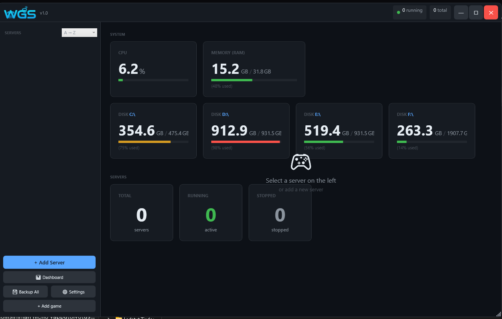
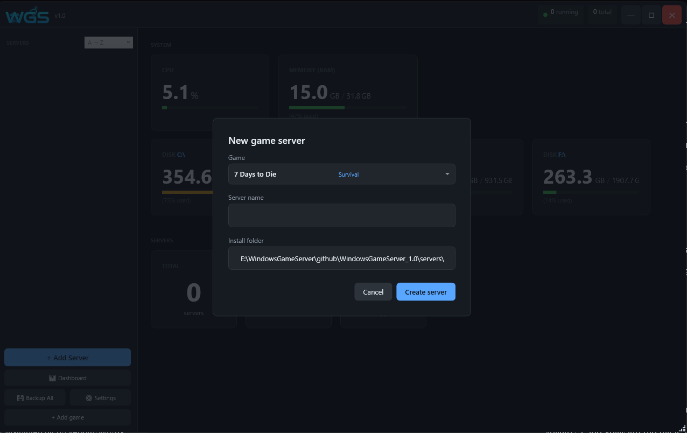
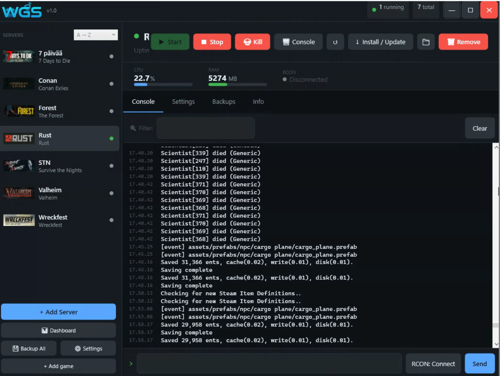
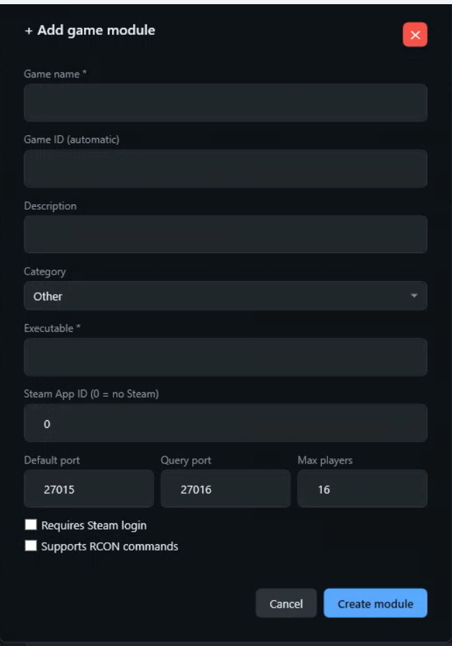
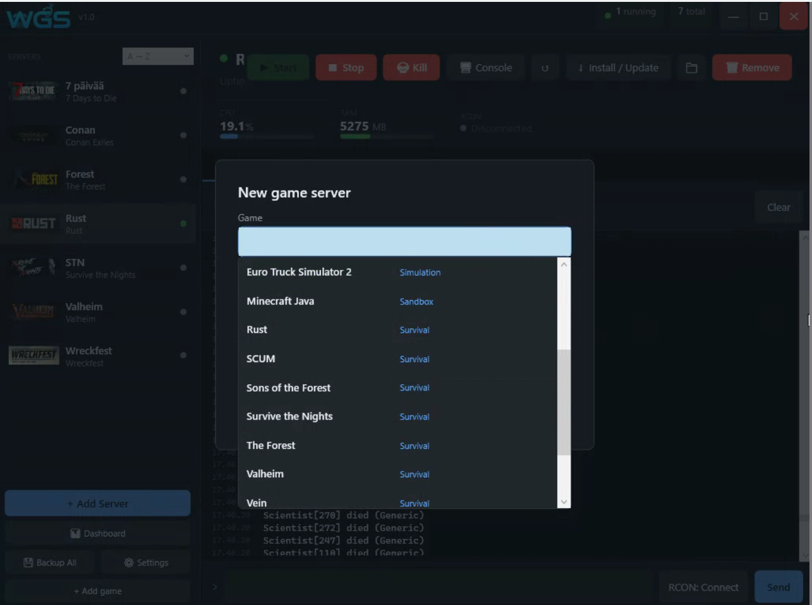

<div align="center">
  
  <h1>Windows Game Server</h1>
  <p><strong>Single-window management panel for Windows game servers</strong></p>


  
  
  
  
  

---

### 📷 Screenshots

<p align="center">
  
  
</p>
<p align="center">
  
  
</p>
<p align="center">
  
</p>

</div>

---

> [!IMPORTANT]
> **Windows SmartScreen Warning:**
>
> Since WGS is an independent open-source tool that manages system-level tasks (Firewall, Process Priorities), Windows might show a "SmartScreen" warning.
> To run WGS: Right-click `WindowsGameServer.exe` → **Properties** → Check **Unblock** at the bottom → **OK**.

---

## ✨ Features

| Feature | Description |
|---|---|
| 🎮 **17+ games** | Ready-made plugins for the most popular game servers |
| ⬇️ **SteamCMD integration** | Install and update with one click |
| 🔄 **Auto Restart** | Automatic restart after crash |
| 💾 **Automatic backups** | Scheduled backups with configurable retention |
| 🛡️ **Firewall management** | Windows Firewall rules managed automatically |
| 📟 **RCON console** | Remote commands directly from the UI |
| 📊 **System metrics** | CPU, RAM and drives in real time on the dashboard |
| ⚙️ **CPU Affinity** | Per-server core selection and process priority |
| 🔧 **Custom Plugin Creator** | Add any game server without writing code |
| 🔔 **System tray** | Runs in background, notifications from tray icon |
| 🔒 **Encrypted credentials** | Steam password and Discord webhook encrypted via DPAPI |

---

## 🎮 Supported Games

### Survival
| Game | Steam AppID | Max Players | Port |
|---|---|---|---|
| Valheim | 896660 | 10 | 2456 |
| Rust | 258550 | 100 | 28015 |
| 7 Days to Die | 294420 | 8 | 26900 |
| Conan Exiles | 443030 | 40 | 7777 |
| ARK: Survival Evolved | 376030 | 70 | 7777 |
| Sons of the Forest | 2465200 | 8 | 8766 |
| The Forest | 556450 | 8 | 27015 |
| Survive the Nights | 1502300 | 16 | 7777 |
| SCUM | 3792580 | 32 | 10000 |
| Vein | 2131400 | 16 | 7777 |

### Racing
| Game | Steam AppID | Max Players | Port |
|---|---|---|---|
| Wreckfest | 361580 | 24 | 33540 |
| Wreckfest 2 | 3519390 | 24 | 27020 |
| Assetto Corsa | 302550 | 18 | 9600 |

### Other
| Game | Steam AppID | Max Players | Port |
|---|---|---|---|
| Minecraft Java | — | 20 | 25565 |
| Euro Truck Simulator 2 | 1948160 | 8 | 27015 |
| Arma Reforger | 1874900 | 64 | 2001 |
| Black Mesa | 346680 | 24 | 27015 |

> The **Custom Plugin Creator** lets you add any other game server without touching code.

---

## 🖥️ Requirements

- **Windows 10 / Windows Server 2019** or newer
- **.NET 8 Runtime** — [download here](https://dotnet.microsoft.com/download/dotnet/8.0)
- **SteamCMD** — downloaded automatically on first install
- Administrator rights for firewall rule management

---

## 🚀 Installation

### Pre-built binary (recommended)

1. Download the latest release from the [Releases](../../releases) page
2. Extract the zip to a folder of your choice
3. Run `WindowsGameServer.exe`
4. If you get a .NET error, install the [.NET 8 Runtime](https://dotnet.microsoft.com/download/dotnet/8.0)

### Build from source

```bash
git clone https://github.com/YOUR_USERNAME/WindowsGameServer.git
cd WindowsGameServer/WGS
dotnet publish -c Release -o publish
```

> Requires [.NET 8 SDK](https://dotnet.microsoft.com/download/dotnet/8.0)

---

## 📦 Project structure

```
WGS/
├── Games/              # Game plugins (IGamePlugin interface)
│   ├── GamePluginBase.cs
│   ├── GameRegistry.cs
│   ├── ValheimPlugin.cs
│   ├── RustPlugin.cs
│   └── ...             # One .cs per game
├── Models/             # Data models (GameServer, ConsoleMessage...)
├── Services/           # Services (ServerManager, SteamCmd, Backup...)
├── ViewModels/         # MVVM ViewModels
├── Views/              # WPF XAML views
└── publish/            # Published executable output
```

---

## 🔌 Adding a custom plugin

### Graphical Plugin Creator

WGS includes a built-in Plugin Creator tool:
1. Open **Tools → Plugin Creator**
2. Fill in the game details (name, Steam AppID, executable, ports...)
3. Click **Save** — the plugin appears in the game list immediately

### Writing a plugin in code

Create a new file `Games/MyGamePlugin.cs`:

```csharp
using WGS.Games;
using WGS.Models;

public class MyGamePlugin : GamePluginBase
{
    public override string GameId           => "mygame";
    public override string GameName         => "My Game";
    public override string Description      => "Short description";
    public override string Category         => "Survival";
    public override int    SteamAppId       => 123456;
    public override string Executable       => "server.exe";
    public override int    DefaultPort      => 7777;
    public override int    DefaultQueryPort => 27015;
    public override int    DefaultMaxPlayers => 32;

    public override string BuildStartArguments(GameServer s)
        => $"-port {s.ServerPort} -queryport {s.QueryPort} -maxplayers {s.MaxPlayers}";
}
```

Register it in `Games/GameRegistry.cs`:
```csharp
Register(new MyGamePlugin());
```

---

## 🏗️ Architecture

```
┌─────────────────────────────────────┐
│            WPF UI (XAML)            │
├──────────────┬──────────────────────┤
│  MainViewModel │  ServerViewModel   │  ← CommunityToolkit.Mvvm
├──────────────┴──────────────────────┤
│  ServerManagerService               │  ← Process management
│  SteamCmdService                    │  ← Install / update
│  BackupService                      │  ← Zip backups
│  FirewallService                    │  ← netsh / COM
│  RconService                        │  ← Source RCON protocol
│  SystemMetricsService               │  ← CPU / RAM / disk
│  ScheduledTaskService               │  ← Task scheduler
│  NotificationService                │  ← Discord webhooks
└─────────────────────────────────────┘
         │
         ▼
┌─────────────────────────────────────┐
│  IGamePlugin (per game)             │
│  GamePluginBase (defaults)          │
│  GameRegistry (registration)        │
└─────────────────────────────────────┘
```

---

## 🤝 Contributing

Pull requests are welcome! For large changes, please open an issue first to discuss what you'd like to change.

1. Fork this repository
2. Create a feature branch: `git checkout -b feature/my-new-feature`
3. Commit your changes: `git commit -m "Add: my new feature"`
4. Push: `git push origin feature/my-new-feature`
5. Open a Pull Request

---

## 📄 License

MIT License — see the [LICENSE](LICENSE) file.

---

## Support
If you find WGS useful, you can support my work here:
[](https://ko-fi.com/madbee71)

<div align="center">
  <sub>Built with .NET 8 · WPF · CommunityToolkit.Mvvm</sub>
</div>
